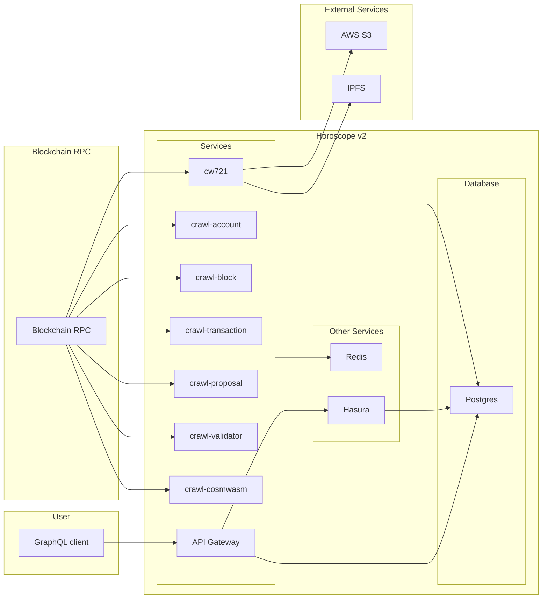

# Horoscope v2

Horoscope v2 is the next version of Horoscope, an indexing service for Cosmos-based blockchains.
It can crawl all blocks and transaction, decode them to readable data, and index them into a Postgres database.
Based on the indexed data, Horoscope offers a GraphQL API that enables users to efficiently search and retrieve data from the blockchain.

Currently, it supports network built by Cosmos SDK v0.45.1 or later. The following networks are officially support by Horoscope v2:

- [Aura Network](https://github.com/aura-nw/aura)
- [Sei](https://sei.io)

> **Looking for Horoscope v1? The Horoscope v1 repository has been archived [`Horoscope v1`](https://github.com/aura-nw/Horoscope)**.

## Overview Architecture

Horoscope v2 consists of multiple services.
All services are small Node applications written in Typescript, built with [Moleculerjs](https://moleculer.services/) framework using [Moleculer TS base](https://github.com/aura-nw/moleculer-ts-base).
The crawler servires utilize [Bull](https://github.com/OptimalBits/bull) for efficient queue management of crawling jobs.

An overview of the architecture is shown below:



The API Gateway service is the only service that is exposed to the public.
All services are stateless and can be scaled horizontally. Crawling jobs are queued in Redis and processed by the crawler services.
The current state of crawling jobs is stored in the database and can be queried via the GraphQL API.

## Services

An incomplete list of services is shown below:

- [**crawl-account**](./docs/services/crawl-account/crawl-account.md): get account auth and its balances
- [**crawl-block**](./docs/services/crawl-block/crawl-block.md): get block from network and insert to DB
- [**crawl-transaction**](./docs/services/crawl-transaction/crawl-tx.md): get transaction in a block and decode to readable
- [**handle-authz-msg**](./docs/services/crawl-transaction/handle-authz-tx-msg.md): handle authz message and decode to readable
- [**crawl-proposal**](./docs/services/crawl-proposal/crawl-proposal.md): get proposal and its status
- [**crawl-validator**](./docs/services/crawl-validator/crawl-validator.md): get validator and their power event, signing info
- [**crawl-genesis**](./docs/services/crawl-genesis/crawl-genesis.md): get state from genesis chunk
- [**crawl-cosmwasm**](./docs/services/crawl-cosmwasm/crawl-smart-contract.md): get codes and contracts
- [**cw721**](./docs/services/cw721/README.md): handle registed asset type CW721
- [**handle-vote**](./docs/services/handle-vote/handle-vote.md): parse vote message

## Database schema

You can view detail database schema [here](./docs/database_schema.md)

## Installation

To install the required dependencies (PostgreSQL, Redis, Hasura), you can use Docker Compose:

```bash
docker-compose up -d
```

This will start the PostgreSQL, Redis, and Hasura containers in the background.
Note: Make sure the required ports are not already in use on your machine.

Create an environment file `.env` from the example file `.env.example`:

```bash
cp .env.example .env
```

Start development mode

```bash
npm run dev
```

### Hasura metadata migration

Read [link](https://hasura.io/docs/latest/hasura-cli/install-hasura-cli/) to install Hasura CLI for your operating system. To make update to hasura metadata programmatically, use sample code below:

```
# init hasura directory
hasura init hasura

# create file env hasura
cp .env.hasura.sample hasura/.env

# go to hasura directory
cd hasura

# export current metadata from hasura
hasura metadata export

# check current diff between local and hasura server
hasura metadata diff

# apply current hasura metadata to server
hasura metadata apply
```

## Configuration

[Config Moleculer](.env.sample), refer [docs](https://moleculer.services/docs/0.14/configuration.html) to get detail configurations.
[Config network](network.json) to config networks with LCD, RPC, database.
[Config chain](config.json) to setup crawling jobs and the crawling chain information.

## Adding a new chain

Setting up Horoscope for a new chain is straight-forward:

- Add the chain to the `network.json` file
- Configure the crawling jobs and chain information in the `config.json` file
- Add the chain to the Hasura metadata (see [Hasura](#hasura) section). For more information about Hasura and how to use Hasura CLI, see the [Hasura documentation](https://hasura.io/docs/latest/graphql/core/index.html). You can remove other chains from the metadata if you don't need them.
- If the chain has custom messages, you may need to add a new message decoder (see [Message Decoders](#message-decoders) section).
- Start crawling your chain :fireworks:
