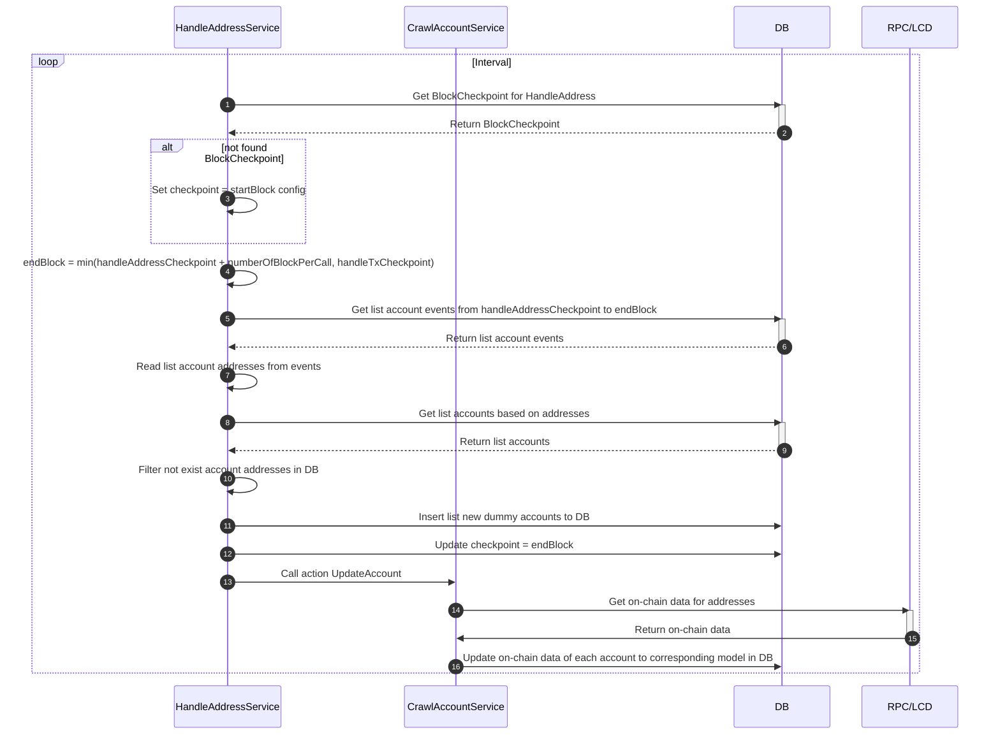

## Crawl Account

```mermaid
  sequenceDiagram
    autonumber
    participant A as HandleAddressService
    participant B as CrawlAccountService
    participant C as DB
    participant D as RPC/LCD

    loop Interval
      A->>C: Get BlockCheckpoint for HandleAddress
      activate C
      C-->>A: Return BlockCheckpoint
      deactivate C
      alt not found BlockCheckpoint
        A->>A: Set checkpoint = startBlock config
      end
      A->>A: endBlock = min(handleAddressCheckpoint + numberOfBlockPerCall, handleTxCheckpoint)

      A->>C: Get list account events from handleAddressCheckpoint to endBlock
      activate C
      C-->>A: Return list account events
      deactivate C
      A->>A: Read list account addresses from events
      A->>C: Get list accounts based on addresses
      activate C
      C-->>A: Return list accounts
      deactivate C
      A->>A: Filter not exist account addresses in DB
      A->>C: Insert list new  dummy accounts to DB
      A->>C: Update checkpoint = endBlock
      A->>B: Call action UpdateAccount

      B->>D: Get on-chain data for addresses
      activate D
      D->>B: Return on-chain data
      deactivate D
      B->>C: Update on-chain data of each account to corresponding model in DB
    end
```
