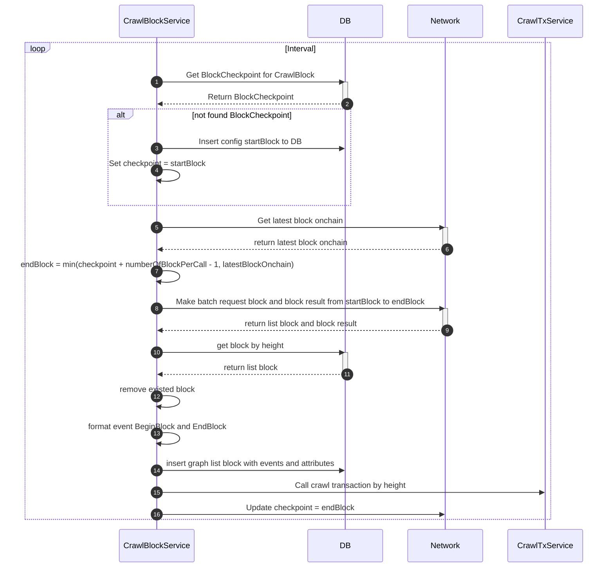

## Crawl Block

```mermaid
  sequenceDiagram
    autonumber
    participant A as CrawlBlockService
    participant B as DB
    participant C as Network
    participant D as CrawlTxService

    loop Interval
      A->>B: Get BlockCheckpoint for CrawlBlock
      activate B
      B-->>A: Return BlockCheckpoint
      deactivate B

      alt not found BlockCheckpoint
        A->>B: Insert config startBlock to DB
        A->>A: Set checkpoint = startBlock
      end

      A->>C: Get latest block onchain
      activate C
      C-->>A: return latest block onchain
      deactivate C

      A->>A: endBlock = min(checkpoint + numberOfBlockPerCall - 1, latestBlockOnchain)

      A->>C: Make batch request block and block result from startBlock to endBlock
      activate C
      C-->>A: return list block and block result
      deactivate C

      A->>B: get block by height
      activate B
      B-->>A: return list block
      deactivate B

      A->>A: remove existed block
      A->>A: format event BeginBlock and EndBlock
      A->>B: insert graph list block with events and attributes
      A->>D: Call crawl transaction by height

      A->>C: Update checkpoint = endBlock
    end
```
