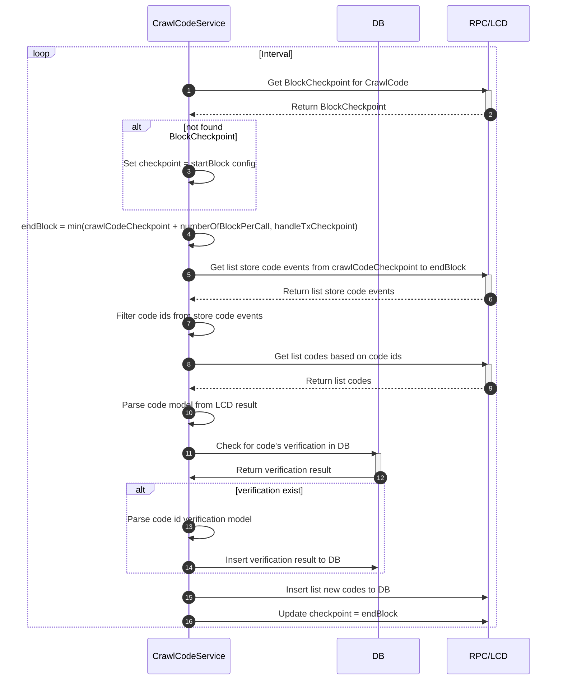

# Crawl Code

```mermaid
  sequenceDiagram
    autonumber
    participant A as CrawlCodeService
    participant B as DB
    participant C as RPC/LCD

    loop Interval
      A->>C: Get BlockCheckpoint for CrawlCode
      activate C
      C-->>A: Return BlockCheckpoint
      deactivate C
      alt not found BlockCheckpoint
        A->>A: Set checkpoint = startBlock config
      end
      A->>A: endBlock = min(crawlCodeCheckpoint + numberOfBlockPerCall, handleTxCheckpoint)

      A->>C: Get list store code events from crawlCodeCheckpoint to endBlock
      activate C
      C-->>A: Return list store code events
      deactivate C
      A->>A: Filter code ids from store code events
      A->>C: Get list codes based on code ids
      activate C
      C-->>A: Return list codes
      deactivate C
      A->>A: Parse code model from LCD result

      A->>B: Check for code's verification in DB
      activate B
      B->>A: Return verification result
      deactivate B
      alt verification exist
        A->>A: Parse code id verification model
        A->>B: Insert verification result to DB
      end

      A->>C: Insert list new  codes to DB
      A->>C: Update checkpoint = endBlock
    end
```
