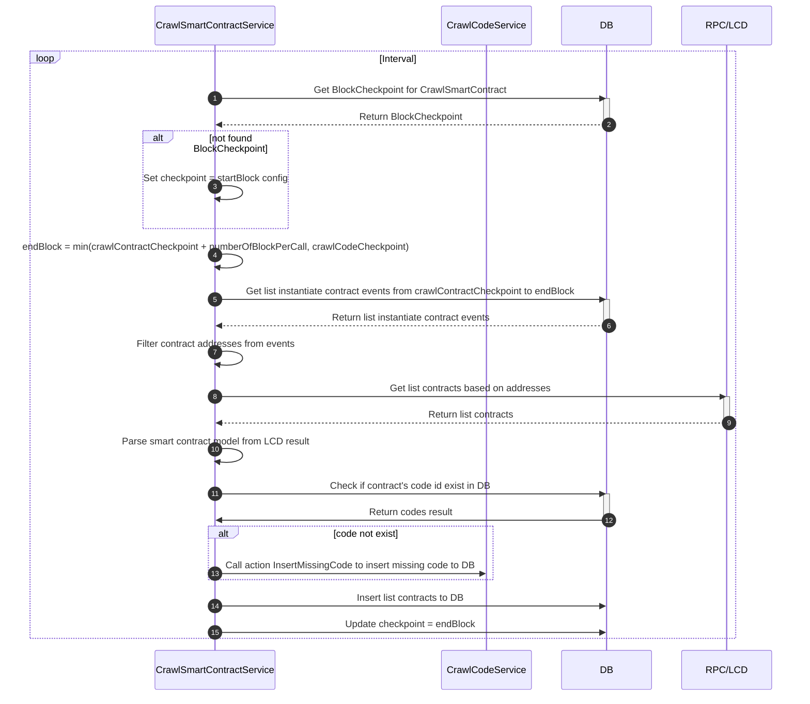

## Crawl Smart Contract

```mermaid
  sequenceDiagram
    autonumber
    participant A as CrawlSmartContractService
    participant B as CrawlCodeService
    participant C as DB
    participant D as RPC/LCD

    loop Interval
      A->>C: Get BlockCheckpoint for CrawlSmartContract
      activate C
      C-->>A: Return BlockCheckpoint
      deactivate C
      alt not found BlockCheckpoint
        A->>A: Set checkpoint = startBlock config
      end
      A->>A: endBlock = min(crawlContractCheckpoint + numberOfBlockPerCall, crawlCodeCheckpoint)

      A->>C: Get list instantiate contract events from crawlContractCheckpoint to endBlock
      activate C
      C-->>A: Return list instantiate contract events
      deactivate C
      A->>A: Filter contract addresses from events
      A->>D: Get list contracts based on addresses
      activate D
      D-->>A: Return list contracts
      deactivate D
      A->>A: Parse smart contract model from LCD result

      A->>C: Check if contract's code id exist in DB
      activate C
      C->>A: Return codes result
      deactivate C
      alt code not exist
        A->>B: Call action InsertMissingCode to insert missing code to DB
      end

      A->>C: Insert list contracts to DB
      A->>C: Update checkpoint = endBlock
    end
```
