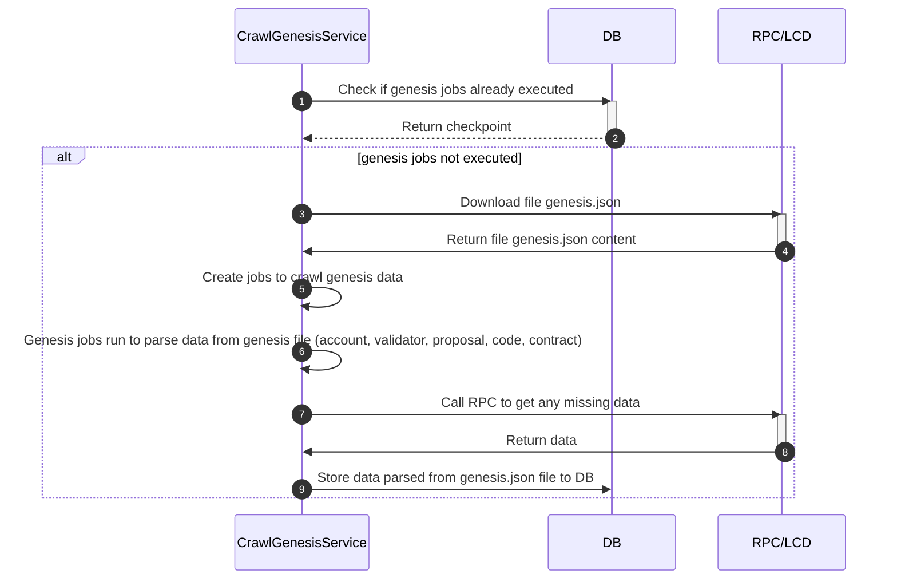

## Crawl Genesis

```mermaid
  sequenceDiagram
    autonumber
    participant A as CrawlGenesisService
    participant B as DB
    participant C as RPC/LCD

    A->>B: Check if genesis jobs already executed
    activate B
    B-->>A: Return checkpoint
    deactivate B

    alt genesis jobs not executed
        A->>C: Download file genesis.json
        activate C
        C->>A: Return file genesis.json content
        deactivate C
        A->>A: Create jobs to crawl genesis data

        A->>A: Genesis jobs run to parse data from genesis file (account, validator, proposal, code, contract)
        A->>C: Call RPC to get any missing data
        activate C
        C->>A: Return data
        deactivate C
        A->>B: Store data parsed from genesis.json file to DB
    end

```
