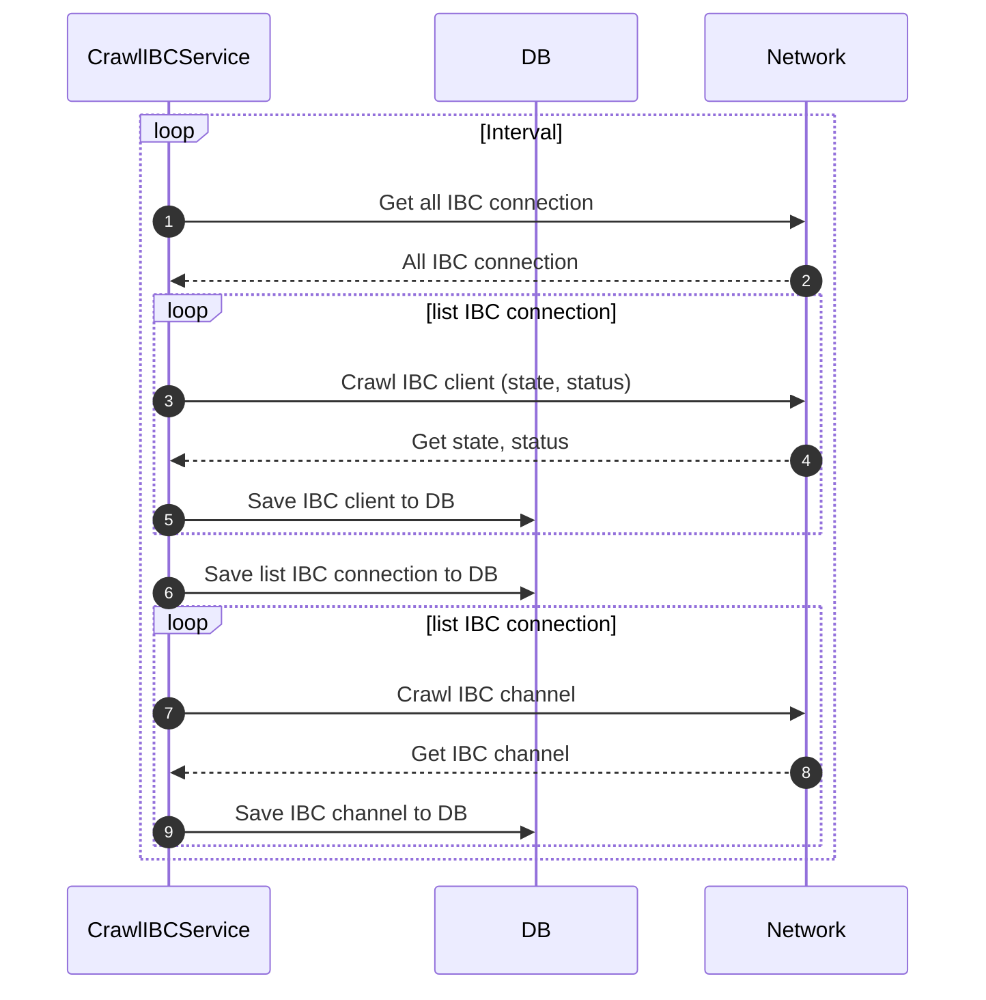

## Crawl IBC

```mermaid
  sequenceDiagram
    autonumber
    participant A as CrawlIBCService
    participant B as DB
    participant C as Network

    loop Interval
      A->>C: Get all IBC connection
      C-->>A: All IBC connection

      loop list IBC connection
        A->>C: Crawl IBC client (state, status)
        C-->>A: Get state, status
        A->>B: Save IBC client to DB
      end

      A->>B: Save list IBC connection to DB

      loop list IBC connection
        A->>C: Crawl IBC channel
        C-->>A: Get IBC channel
        A->>B: Save IBC channel to DB
      end

    end
```
