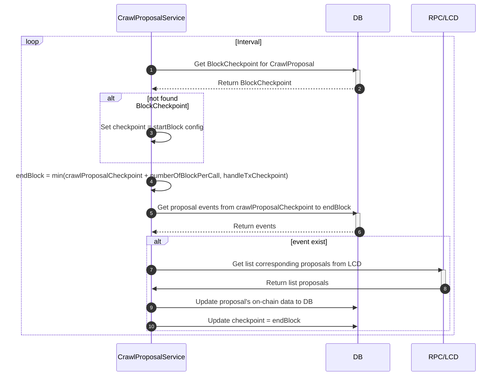

## Crawl Proposal

```mermaid
  sequenceDiagram
    autonumber
    participant A as CrawlProposalService
    participant B as DB
    participant C as RPC/LCD

    loop Interval
      A->>B: Get BlockCheckpoint for CrawlProposal
      activate B
      B-->>A: Return BlockCheckpoint
      deactivate B
      alt not found BlockCheckpoint
        A->>A: Set checkpoint = startBlock config
      end
      A->>A: endBlock = min(crawlProposalCheckpoint + numberOfBlockPerCall, handleTxCheckpoint)

      A->>B: Get proposal events from crawlProposalCheckpoint to endBlock
      activate B
      B-->>A: Return events
      deactivate B
      alt event exist
        A->>C: Get list corresponding proposals from LCD
        activate C
        C->>A: Return list proposals
        deactivate C
        A->>B: Update proposal's on-chain data to DB
        A->>B: Update checkpoint = endBlock
      end
    end
```
