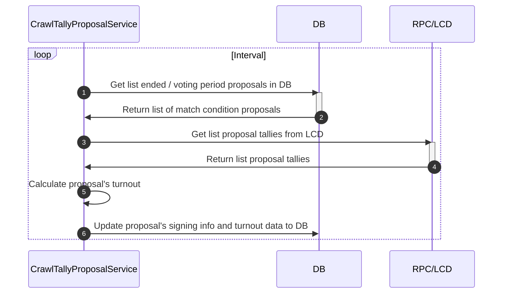

## Crawl Tally Proposal

```mermaid
  sequenceDiagram
    autonumber
    participant A as CrawlTallyProposalService
    participant B as DB
    participant C as RPC/LCD

    loop Interval
      A->>B: Get list ended / voting period proposals in DB
      activate B
      B->>A: Return list of match condition proposals
      deactivate B
      A->>C: Get list proposal tallies from LCD
      activate C
      C->>A: Return list proposal tallies
      deactivate C
      A->>A: Calculate proposal's turnout
      A->>B: Update proposal's signing info and turnout data to DB
    end
```
