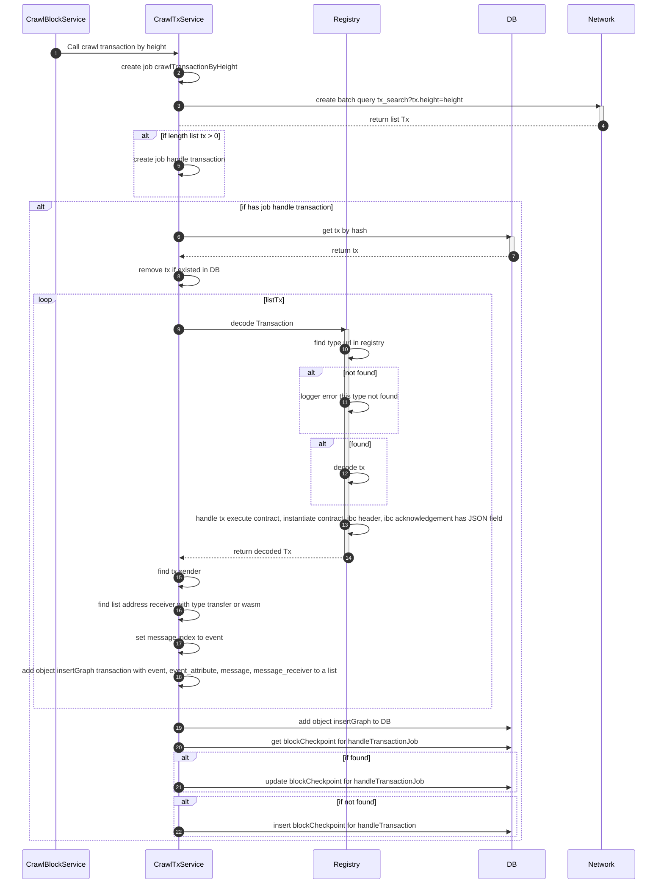

## Crawl Transaction

```mermaid
  sequenceDiagram
    autonumber
    participant A as CrawlBlockService
    participant B as CrawlTxService
    participant E as Registry
    participant C as DB
    participant D as Network

    A->>B: Call crawl transaction by height
    B->>B: create job crawlTransactionByHeight

    B->>D: create batch query tx_search?tx.height=height
    activate D
    D-->B: return list Tx
    deactivate D
    alt if length list tx > 0
      B->>B: create job handle transaction
    end
    alt if has job handle transaction
      B->>C: get tx by hash
      activate C
      C-->>B: return tx
      deactivate C

      B->>B: remove tx if existed in DB

      loop listTx
        B->>E: decode Transaction
        activate E
        E->>E: find type url in registry

        alt not found
          E->>E: logger error this type not found
        end
        alt found
          E->>E: decode tx
        end

        E->>E: handle tx execute contract, instantiate contract, ibc header, ibc acknowledgement has JSON field
        E-->>B: return decoded Tx
        deactivate E

        B->>B: find tx sender
        B->>B: find list address receiver with type transfer or wasm
        B->>B: set message index to event
        B->>B: add object insertGraph transaction with event, event_attribute, message, message_receiver to a list
      end
      B->>C: add object insertGraph to DB

      B->>C: get blockCheckpoint for handleTransactionJob
      alt if found
        B->>C: update blockCheckpoint for handleTransactionJob
      end
      alt if not found
        B->>C: insert blockCheckpoint for handleTransaction
      end
    end
```
