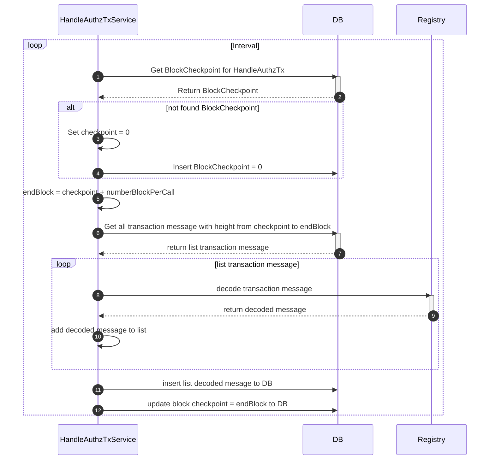

## Handle Authz transaction message

```mermaid
  sequenceDiagram
    autonumber
    participant A as HandleAuthzTxService
    participant B as DB
    participant C as Registry

    loop Interval
      A->>B: Get BlockCheckpoint for HandleAuthzTx
      activate B
      B-->>A: Return BlockCheckpoint
      deactivate B

      alt not found BlockCheckpoint
        A->>A: Set checkpoint = 0
        A->>B: Insert BlockCheckpoint = 0
      end

      A->>A: endBlock = checkpoint + numberBlockPerCall

      A->>B: Get all transaction message with height from checkpoint to endBlock
      activate B
      B-->>A: return list transaction message
      deactivate B

      loop list transaction message
        A->>C: decode transaction message
        activate C
        C-->>A: return decoded message
        deactivate C
        A->>A: add decoded message to list
      end
      A->>B: insert list decoded mesage to DB
      A->>B: update block checkpoint = endBlock to DB
    end
```
