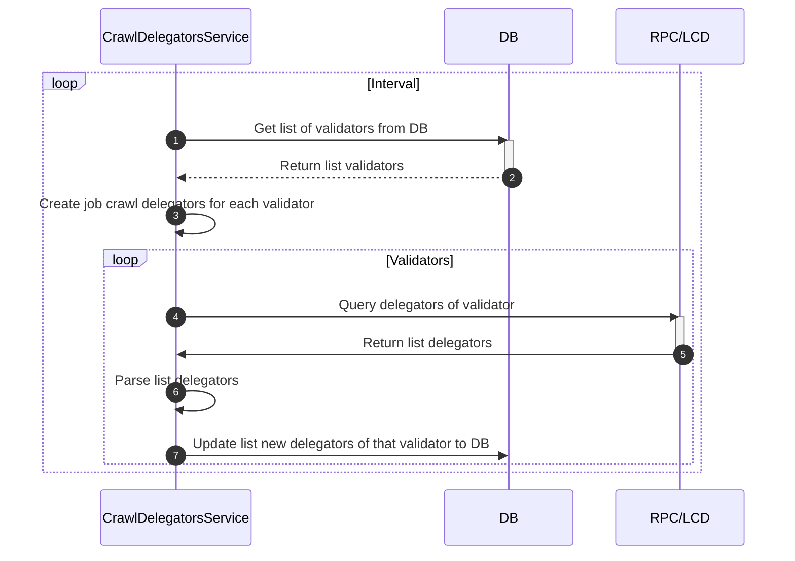

## Crawl Delegators

```mermaid
  sequenceDiagram
    autonumber
    participant A as CrawlDelegatorsService
    participant B as DB
    participant C as RPC/LCD

    loop Interval
      A->>B: Get list of validators from DB
      activate B
      B-->>A: Return list validators
      deactivate B
      A->>A: Create job crawl delegators for each validator

      loop Validators
        A->>C: Query delegators of validator
        activate C
        C->>A: Return list delegators
        deactivate C
        A->>A: Parse list delegators
        A->>B: Update list new delegators of that validator to DB
      end
    end
```
