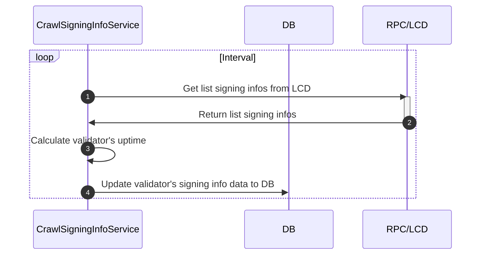

## Crawl Signing Info

```mermaid
  sequenceDiagram
    autonumber
    participant A as CrawlSigningInfoService
    participant B as DB
    participant C as RPC/LCD

    loop Interval
      A->>C: Get list signing infos from LCD
      activate C
      C->>A: Return list signing infos
      deactivate C
      A->>A: Calculate validator's uptime
      A->>B: Update validator's signing info data to DB
    end
```
