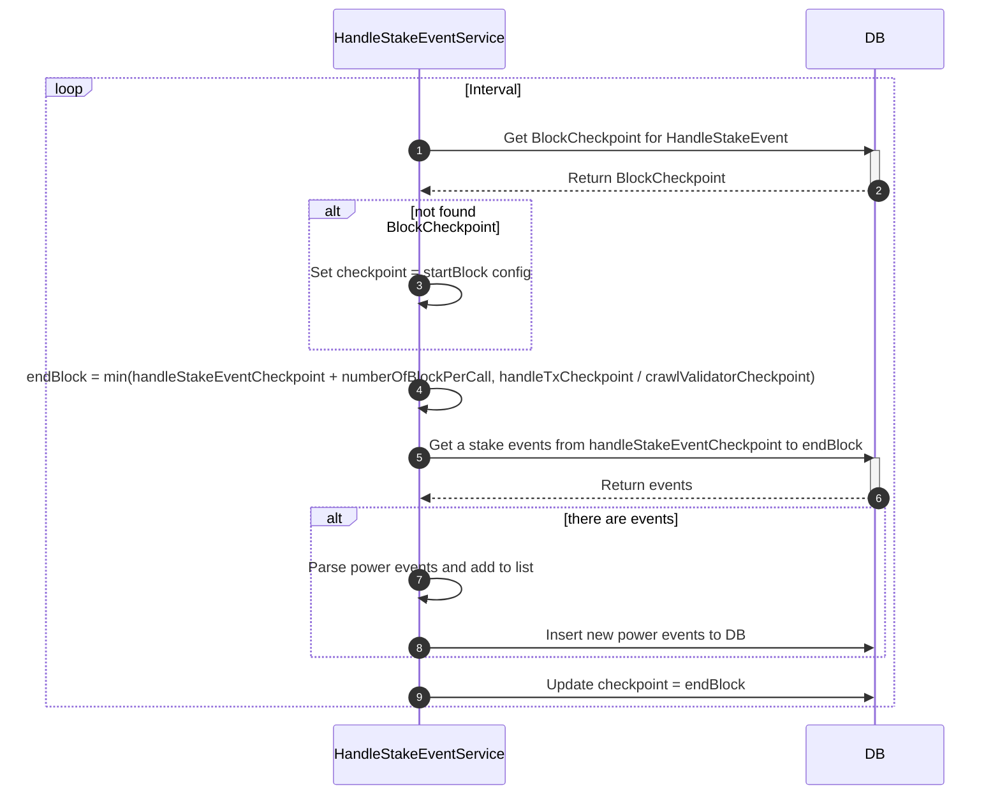

## Handle Stake Event

```mermaid
  sequenceDiagram
    autonumber
    participant A as HandleStakeEventService
    participant B as DB

    loop Interval
      A->>B: Get BlockCheckpoint for HandleStakeEvent
      activate B
      B-->>A: Return BlockCheckpoint
      deactivate B
      alt not found BlockCheckpoint
        A->>A: Set checkpoint = startBlock config
      end
      A->>A: endBlock = min(handleStakeEventCheckpoint + numberOfBlockPerCall, handleTxCheckpoint / crawlValidatorCheckpoint)

      A->>B: Get a stake events from handleStakeEventCheckpoint to endBlock
      activate B
      B-->>A: Return events
      deactivate B
      alt there are events
        A->>A: Parse power events and add to list
        A->>B: Insert new power events to DB
      end
      A->>B: Update checkpoint = endBlock
    end
```
