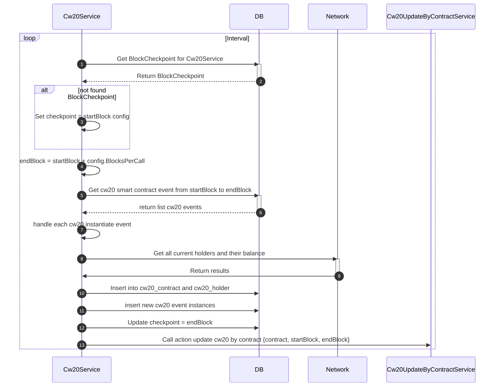

## Cw20 Service

```mermaid
  sequenceDiagram
    autonumber
    participant A as Cw20Service
    participant B as DB
    participant C as Network
    participant D as Cw20UpdateByContractService
    loop Interval
      A->>B: Get BlockCheckpoint for Cw20Service
      activate B
      B-->>A: Return BlockCheckpoint
      deactivate B
      alt not found BlockCheckpoint
        A->>A: Set checkpoint = startBlock config
      end
      A->>A: endBlock = startBlock + config.BlocksPerCall
      A->>B: Get cw20 smart contract event from startBlock to endBlock
      activate B
      B-->>A: return list cw20 events
      deactivate B
      A->>A: handle each cw20 instantiate event
      A->>C: Get all current holders and their balance
      activate C
      C->>A: Return results
      deactivate C
      A->>B: Insert into cw20_contract and cw20_holder
      A->>B: insert new cw20 event instances
      A->>B: Update checkpoint = endBlock
      A->>D: Call action update cw20 by contract {contract, startBlock, endBlock}
    end
```
