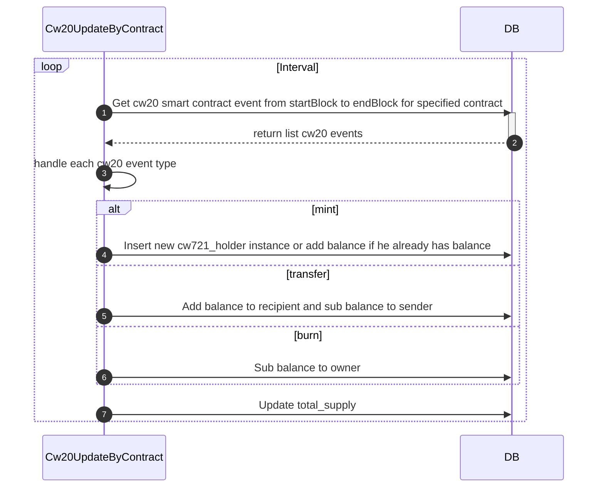

## Cw20 Update By Contract Service

```mermaid
  sequenceDiagram
    autonumber
    participant A as Cw20UpdateByContract
    participant B as DB
    loop Interval
      A->>B: Get cw20 smart contract event from startBlock to endBlock for specified contract
      activate B
      B-->>A: return list cw20 events
      deactivate B
      A->>A: handle each cw20 event type
      alt mint
        A->>B: Insert new cw721_holder instance or add balance if he already has balance
      else transfer
        A->>B: Add balance to recipient and sub balance to sender
      else burn
        A->>B: Sub balance to owner
      end
      A->>B: Update total_supply
    end
```
