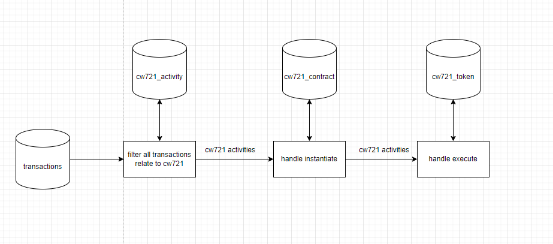

# Cw721 service

Cw721 service is one of services which Horoscope-v2 provide. From transactions, it filter all transactions relating to Cw721: instantiate, mint, transfer, burn, then handle it to update status of all user in Aura network.

## Database

There are 3 tables:

- Cw721_activity: save all activities about cw721, each activity belong to one transaction and probably relate to any token.
- Cw721_contract: cw721 contracts in Aura
- Cw721_token: cw721 tokens in Aura, each token belongs to one contract which link over cw721_contract_id

## Handle activities

### Instantiate

1. Insert new record about instantiate action into cw721_activity
2. Insert new contract into cw721_contract

### Mint

1. Insert new record about mint action into cw721_activity
2. Upsert token into cw721_contract: if it haven't been existed, insert new record, otherwise update burned status to false

### Transfer

1. Insert new record about transfer action into cw721_activity
2. Update token in cw721_token: update new owner

### Burn

1. Insert new record about burn action into cw721_activity
2. Update token in cw721_token: update burned status to false
