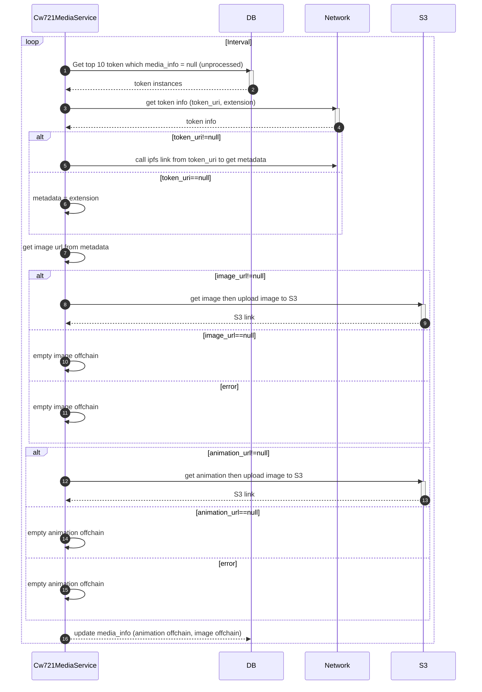

## Cw721 Media Service

```mermaid
  sequenceDiagram
    autonumber
    participant A as Cw721MediaService
    participant B as DB
    participant C as Network
    participant D as S3

    loop Interval
      A->>B: Get top 10 token which media_info = null (unprocessed)
      activate B
      B-->>A: token instances
      deactivate B

      A->>C: get token info (token_uri, extension)
      activate C
      C-->>A: token info
      deactivate C

      alt token_uri!=null
        A->>C: call ipfs link from token_uri to get metadata
      else token_uri==null
        A->>A: metadata = extension
      end

      A->>A: get image url from metadata
      alt image_url!=null
        A->>D: get image then upload image to S3
        activate D
        D-->>A: S3 link
        deactivate D
      else image_url==null
        A->>A: empty image offchain
      else error
        A->>A: empty image offchain
      end

      alt animation_url!=null
        A->>D: get animation then upload image to S3
        activate D
        D-->>A: S3 link
        deactivate D
      else animation_url==null
        A->>A: empty animation offchain
      else error
        A->>A: empty animation offchain
      end

      A-->>B: update media_info (animation offchain, image offchain)
    end
```
