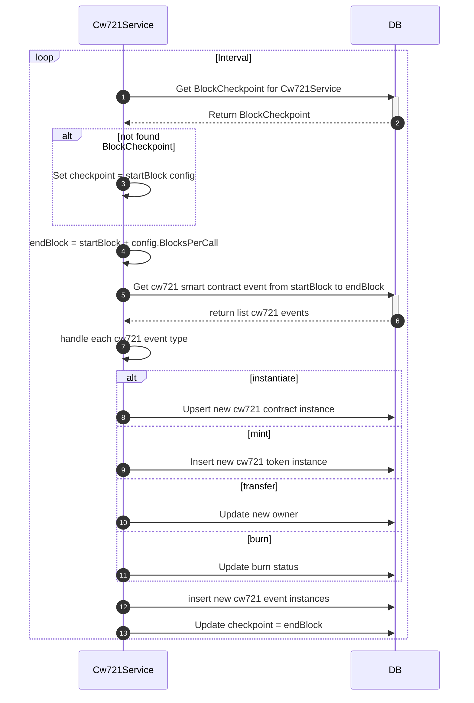

## Cw721 Service

```mermaid
  sequenceDiagram
    autonumber
    participant A as Cw721Service
    participant B as DB

    loop Interval
      A->>B: Get BlockCheckpoint for Cw721Service
      activate B
      B-->>A: Return BlockCheckpoint
      deactivate B
      alt not found BlockCheckpoint
        A->>A: Set checkpoint = startBlock config
      end
      A->>A: endBlock = startBlock + config.BlocksPerCall

      A->>B: Get cw721 smart contract event from startBlock to endBlock
      activate B
      B-->>A: return list cw721 events
      deactivate B
      A->>A: handle each cw721 event type

      alt instantiate
        A->>B: Upsert new cw721 contract instance
      else mint
        A->>B: Insert new cw721 token instance
      else transfer
        A->>B: Update new owner
      else burn
        A->>B: Update burn status
      end

      A->>B: insert new cw721 event instances
      A->>B: Update checkpoint = endBlock
    end
```
