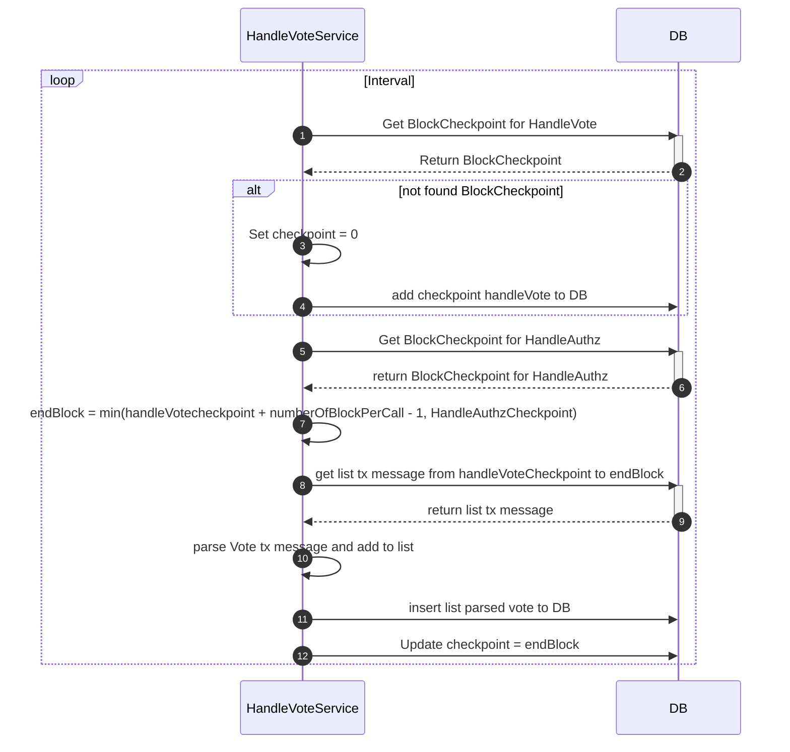

## Handle vote

```mermaid
  sequenceDiagram
    autonumber
    participant A as HandleVoteService
    participant B as DB

    loop Interval
      A->>B: Get BlockCheckpoint for HandleVote
      activate B
      B-->>A: Return BlockCheckpoint
      deactivate B
      alt not found BlockCheckpoint
        A->>A: Set checkpoint = 0
        A->>B: add checkpoint handleVote to DB
      end
      A->>B: Get BlockCheckpoint for HandleAuthz
      activate B
      B-->>A: return BlockCheckpoint for HandleAuthz
      deactivate B
      A->>A: endBlock = min(handleVotecheckpoint + numberOfBlockPerCall - 1, HandleAuthzCheckpoint)


      A->>B: get list tx message from handleVoteCheckpoint to endBlock
      activate B
      B-->>A: return list tx message
      deactivate B
      A->>A: parse Vote tx message and add to list
      A->>B: insert list parsed vote to DB
      A->>B: Update checkpoint = endBlock
    end
```
