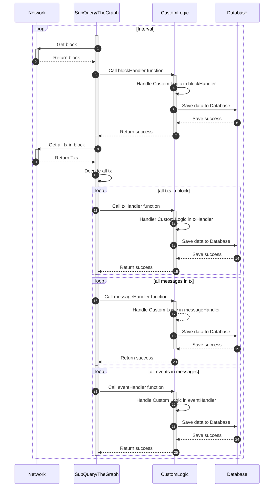
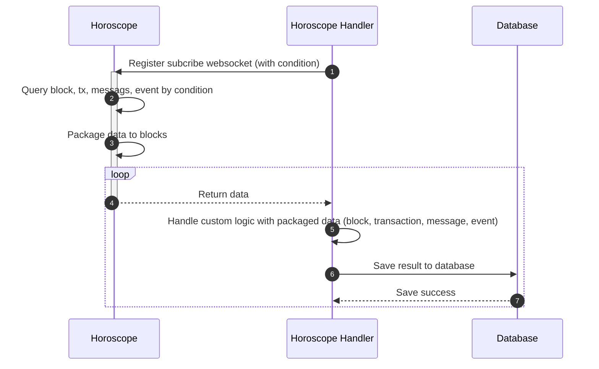

# Horoscope handler

## Subquery, The Graph

Both The Graph and Subquery are open-source data indexer and provide GraphQL to query data that is difficult to query directly onchain. They have their SDK for each type network (Ethereum, Polygon, Arbitrum, Cosmos, etc...). Each package almost follow their rules and allow developer customize with 4 function:

- blockHandler
- txHandler
- messageHandler
- eventHandler

https://github.com/subquery/subql-cosmos/blob/main/packages/node/src/indexer/indexer.manager.ts

Firstly, developer must define their graphql model, then generate typescipt model from graphql. Secondtly, they update their business logic in 4 functions, their main flow:

## Horoscope handler

